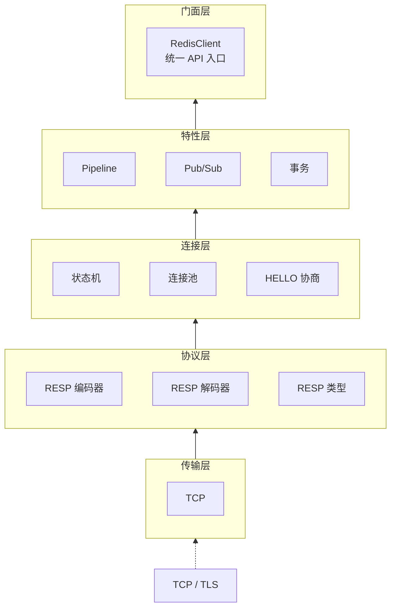

# 仓颉 Redis 客户端

[](LICENSE)
[](cangjie-lang.cn)
[](redis.io)


基于**仓颉编程语言**实现的完整 Redis 协议客户端，支持 **RESP2 + RESP3** 全协议、Pipeline、事务、Pub/Sub、集群等所有核心功能。

---

## 特性

### 🔌 协议层
- **RESP2 完整**：SimpleString、Error、Integer、BulkString（含 null）、Array（含 null）
- **RESP3 完整**：Null、Boolean、Double（含 inf/-inf/nan）、BigNumber、VerbatimString、BulkError、Map、Set、Push、Attribute
- **流式类型**：`$?` 流式字符串、`*?`/`~?`/`%?` 流式聚合、`.` 终止符
- **二进制安全**：`Blob` 值类型支持任意二进制数据无损传输
- **Push 拦截**：注册回调自动处理服务端推送消息
- **Attribute 透传**：属性数据保存在侧通道，不影响主响应解析
- **HELLO 自动协商**：连接时自动发送 `HELLO 3`，兼容 RESP2/RESP3

### 🚀 功能特性
| 特性 | 状态 |
|------|------|
| Pipeline 流水线 | ✅ 批量发送/接收 |
| 事务 (MULTI/EXEC/WATCH) | ✅ 链式调用 |
| Pub/Sub 发布订阅 | ✅ 含分片 Pub/Sub (Redis 7.0+) |
| SCAN 游标迭代器 | ✅ SCAN/HSCAN/SSCAN/ZSCAN |
| 连接池 | ✅ 最大连接数/空闲超时/健康检查 |
| 集群 | ✅ MOVED/ASK 自动重定向 + CRC16 槽位计算 + HashTag |
| 线程安全 | ✅ Mutex + synchronized 保护 |
| 连接超时 | ✅ connectTimeout / readTimeout / writeTimeout |

### 📚 命令覆盖 (~98%)
| 类别 | 命令数 | 覆盖 |
|------|--------|------|
| 字符串 | 28 | 100% |
| 列表 | 22 | 100% |
| 哈希 | 16 | 100% |
| 集合 | 17 | 100% |
| 有序集合 | 31 | 100% |
| 流 | 22 | 100% (含消费组全部命令) |
| 地理 | 11 | 100% |
| 脚本 | 12 | 100% |
| 服务器 | 55 | 100% |
| 键 | 32 | 100% |
| 发布/订阅 | 13 | 100% (含分片) |
| 事务 | 5 | 100% |
| 连接 | 18 | 100% |
| 集群客户端 | 26 | 含自动重定向 |

---

## 架构设计

### 六层架构



### 设计模式

| 模式 | 应用位置 |
|------|---------|
| **Facade** | `RedisClient` — 统一入口 |
| **Strategy** | `Transport` 接口 — TCP/TLS 可互换 |
| **State** | `ConnectionState` — 7 种状态机 |
| **Observer** | `PushObserver` — Pub/Sub 回调 |
| **Command** | `Command<T>` — 每个命令独立编解码 |
| **Template Method** | `Command.execute()` — 编解码骨架 |
| **Pool** | `ConnectionPool` — acquire/release |
| **Iterator** | `ScanIterator` — 游标遍历 |
| **Extension** | `extend RedisClient` — 模块化命令 |

---

## 快速开始

### 环境要求

- [仓颉编译器](https://cangjie-lang.cn) 1.1.3+
- Redis 服务器 6.0+（推荐 7.0+）

### 编译与运行

```bash
# 编译
source /path/to/cangjie/envsetup.sh
cjpm build

# 运行演示（需要本地 Redis 127.0.0.1:6379）
cjpm run

# 运行单元测试
cjpm test
```

### 基本用法

```cangjie
import redis.client.*

// cjpm.toml
[dependencies]
redis = { git = "https://github.com/your-org/redis-cj.git", tag = "v1.0.0" }

main() {
    // 字符串操作
    client.set("key", Blob.fromUtf8("你好，仓颉！"))
    let val = client.get("key")
    println(val.getOrThrow())

    // 列表操作
    client.lpush("mylist", [Blob.fromUtf8("a"), Blob.fromUtf8("b")])
    let items = client.lrange("mylist", 0, -1)

    // 哈希操作
    client.hset("myhash", "field1", Blob.fromUtf8("value1"))
    let all = client.hgetAll("myhash")

    // 事务
    let txn = Transaction(client)
    txn.watch(["key1"])
    txn.multi()
    txn.queue(["SET", "key1", "val1"])
    txn.queue(["GET", "key1"])
    let results = txn.exec()

    // Pipeline
    let pipeResults = client.pipeline([
        ["INCR", "counter"],
        ["INCR", "counter"],
        ["GET", "counter"],
    ])

    // Pub/Sub
    client.subscribe(["channel"]) { type, channel, message =>
        println("收到消息: ${channel} → ${message}")
    }
    client.publish("channel", Blob.fromUtf8("Hello!"))

    // SCAN 迭代
    let scanner = ScanIterator(client)
    while (true) {
        match (scanner.next()) {
            case Some(keys) =>
                for (key in keys) { println(key) }
            case None => break
        }
    }

    // 集群客户端
    try (cluster = ClusterClient(["127.0.0.1:7000"])) {
        cluster.set("key", Blob.fromUtf8("value"))
        let v = cluster.get("key")
    }
}
```

---

## 项目结构

```
redis-cj/
├── cjpm.toml                       # 仓颉项目管理配置
├── README.md                       # 项目说明
├── RESP2-SPEC.md                   # RESP2 协议规范（英文原版）
├── RESP2-SPEC-中文版.md            # RESP2 协议规范（中文翻译）
├── RESP3-SPEC.md                   # RESP3 协议规范（英文原版）
├── RESP3-SPEC-中文版.md            # RESP3 协议规范（中文翻译）
└── src/
    ├── main.cj                     # 演示入口
    ├── utils_blob.cj               # Blob 二进制安全类型
    ├── utils_errors.cj             # 错误类型层次
    ├── utils_scan_iter.cj          # SCAN 游标迭代器
    ├── resp_types.cj               # RESP 值类型枚举（17 种变体）
    ├── resp_encoder.cj             # RESP 编码器
    ├── resp_decoder.cj             # RESP 解码器（流式/属性/Push）
    ├── transport_iface.cj          # Transport 接口
    ├── transport_tcp.cj            # TCP 传输实现
    ├── conn_state.cj               # 连接状态枚举
    ├── conn_connection.cj          # Redis 连接（状态机 + HELLO）
    ├── conn_pool.cj                # 连接池
    ├── client_redis_client.cj      # Redis 客户端门面
    ├── client_pipeline.cj          # Pipeline 流水线
    ├── client_pubsub.cj            # 发布/订阅
    ├── client_transaction.cj       # 事务
    ├── client_protocol.cj          # 协议协商
    ├── commands_base.cj            # Command<T> 抽象类 + 解析辅助
    ├── commands_string.cj          # 字符串命令
    ├── commands_list.cj            # 列表命令
    ├── commands_hash.cj            # 哈希命令
    ├── commands_set.cj             # 集合命令
    ├── commands_sorted_set.cj      # 有序集合命令
    ├── commands_stream.cj          # 流命令
    ├── commands_geo_bitmap_hll.cj  # 地理 + 位图 + HyperLogLog
    ├── commands_scripting.cj       # 脚本命令
    ├── commands_server.cj          # 服务器命令
    ├── commands_key.cj             # 键命令
    ├── commands_connection.cj      # 连接命令
    ├── cluster_slot_map.cj         # 集群槽位映射 + CRC16
    ├── cluster_client.cj           # 集群客户端
    ├── *_test.cj                   # 单元测试文件
    └── commands_integration_test.cj# 集成测试
```

---

## 发布与引用

### 作为依赖使用

```toml
# cjpm.toml
[dependencies]
redis = { git = "https://github.com/your-org/redis-cj.git", tag = "v1.0.0" }
```

```cangjie
import redis.client.*

main() {
    try (client = RedisClient("127.0.0.1", 6379u16)) {
        client.set("key", Blob.fromUtf8("你好"))
        let val = client.get("key")
        println(val.getOrThrow())
    }
}
```

### 发布到中央仓库前的检查清单

| 项目 | 状态 |
|------|------|
| `cjpm.toml` 包名 `name` | ✅ `redis` |
| `cjpm.toml` 组织 `organization` | ✅ 已设置 |
| `cjpm.toml` 版本号 `version` | ✅ `1.0.0` |
| 源文件 `package` 声明一致 | ✅ 全部 `redis.client` |
| `LICENSE` 许可证文件 | ✅ Apache 2.0 |
| `.gitignore` | ✅ 已添加 |
| `README.md` | ✅ 中英文文档 |
| 单元测试 | ✅ 127 通过 |
| 命令覆盖 | ✅ ~98% |
| RESP2/RESP3 协议 | ✅ 全部 17 种类型 |

当前仓颉语言通过 **Git 依赖** 分发包（`cjpm.toml` 支持 `git` 与 `path` 协议），暂无中央仓库。将项目推送到 GitHub 后，其他项目即可通过 Git 依赖引用。

---

## 协议文档

项目附带了完整的 Redis 协议规范文档（中英文对照）：

| 文档 | 语言 | 说明 |
|------|------|------|
| `docs/RESP2-SPEC.md` | English | 官方 RESP2 规范 |
| `docs/RESP2-SPEC-中文版.md` | 中文 | RESP2 规范中文翻译 |
| `docs/RESP3-SPEC.md` | English | 官方 RESP3 规范 |
| `docs/RESP3-SPEC-中文版.md` | 中文 | RESP3 规范中文翻译 |

---

## 许可证

本项目基于 MIT 许可证开源。
