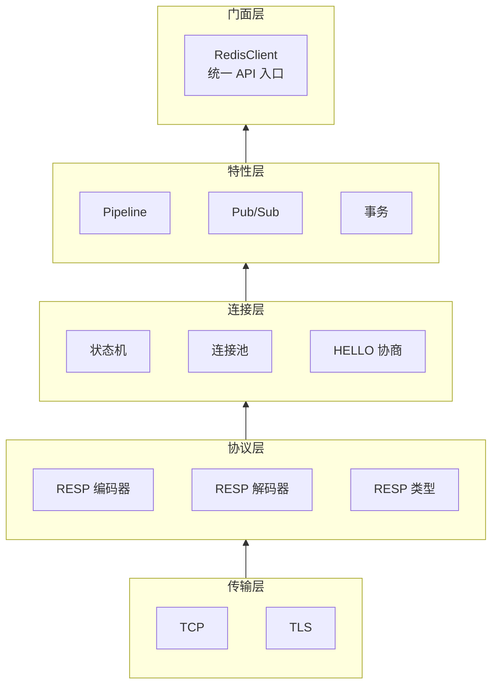

# 仓颉 Redis 客户端

[](LICENSE)
[](cangjie-lang.cn)
[](redis.io)


基于**仓颉编程语言**实现的完整 Redis 协议客户端，支持 **RESP2 + RESP3** 全协议、Pipeline、事务、Pub/Sub、集群、**TLS 加密传输**等所有核心功能。

## 当前状态

纯客户端侧核心能力已完成并通过构建与测试验证：

- `cjpm build --verbose` 通过
- `cjpm test` 通过，251 个测试用例全部成功
- RESP2/RESP3 编解码、连接管理、连接池、Pipeline、事务、Pub/Sub、SCAN、Cluster 路由与重定向等客户端职责已覆盖
- 非客户端 P0 范围：Redis Stack/模块命令 typed wrapper、偏服务端运维管理命令全量封装、真实 Redis Cluster 环境集成测试

---

## 特性

### 🔌 协议层
- **RESP2 完整**：SimpleString、Error、Integer、BulkString（含 null）、Array（含 null）
- **RESP3 完整**：Null、Boolean、Double（含 inf/-inf/nan）、BigNumber、VerbatimString、BulkError、Map、Set、Push、Attribute
- **流式类型**：`$?` 流式字符串、`*?`/`~?`/`%?` 流式聚合、`.` 终止符
- **二进制安全**：`Blob` 值类型支持任意二进制数据无损传输
- **Push 拦截**：注册回调自动处理服务端推送消息
- **Attribute 透传**：属性数据保存在侧通道，不影响主响应解析
- **HELLO 自动协商**：连接时自动发送 `HELLO 3`，兼容 RESP2/RESP3

### 🚀 功能特性
| 特性 | 状态 |
|------|------|
| Pipeline 流水线 | ✅ 批量发送/接收 |
| 事务 (MULTI/EXEC/WATCH) | ✅ 链式调用 |
| Pub/Sub 发布订阅 | ✅ 含分片 Pub/Sub (Redis 7.0+) |
| SCAN 游标迭代器 | ✅ SCAN/HSCAN/SSCAN/ZSCAN |
| 连接池 | ✅ 最大连接数/空闲超时/健康检查 |
| TLS 加密传输 | ✅ 基于 stdx.net.tls，支持 TLS 1.2/1.3 |
| 集群 | ✅ MOVED/ASK 自动重定向 + CRC16 槽位计算 + HashTag |
| 线程安全 | ✅ Mutex + synchronized 保护 |
| 连接超时 | ✅ connectTimeout / readTimeout / writeTimeout |

### 📚 命令覆盖（客户端视角）

| 分类 | 命令类别 | 具体命令 | 状态 |
|------|----------|----------|------|
| **核心协议** | RESP2 协议解码 | SimpleString / Error / Integer / BulkString / Array + null 变体 | ✅ |
| | RESP3 协议解码 | Null / Boolean / Double / BigNumber / VerbatimString / BulkError / Map / Set / Push / Attribute | ✅ |
| | RESP3 流式类型 | StreamedString / StreamedArray / StreamedSet / StreamedMap / End | ✅ |
| | 协议编码 | 命令编码（Array of BulkStrings）/ 单值编码 / 流式分块编码 | ✅ |
| | HELLO 自动协商 | 自动发送 HELLO 3，兼容 RESP2/RESP3 回退 | ✅ |
| **传输层** | TCP 传输 | TcpTransport，支持连接/读写超时 | ✅ |
| | TLS 加密传输 | TlsTransport，TLS 1.2/1.3，支持 TrustAll/CustomCA/Default 验证 | ✅ |
| | 连接池 | ConnectionPool，maxSize / idleTimeout / 空闲驱逐 | ✅ |
| **字符串命令** | 基本读写 | SET / GET / GETDEL / GETEX / GETSET | ✅ |
| | 批量操作 | MGET / MSET / MSETNX | ✅ |
| | 数值操作 | INCR / DECR / INCRBY / DECRBY / INCRBYFLOAT | ✅ |
| | 区间操作 | APPEND / STRLEN / GETRANGE / SETRANGE | ✅ |
| | 原子操作 | SETNX / SETEX / PSETEX | ✅ |
| **哈希命令** | 基本读写 | HSET / HGET / HDEL / HEXISTS | ✅ |
| | 批量操作 | HGETALL / HKEYS / HVALS / HLEN / HMGET / HMSET | ✅ |
| | 数值操作 | HINCRBY / HINCRBYFLOAT | ✅ |
| | 其他 | HSETNX / HSTRLEN / HRANDFIELD | ✅ |
| **列表命令** | 推入弹出 | LPUSH / RPUSH / LPOP / RPOP | ✅ |
| | 阻塞操作 | BLPOP / BRPOP / BLMOVE | ✅ |
| | 查询 | LLEN / LRANGE / LINDEX / LPOS | ✅ |
| | 修改 | LSET / LREM / LTRIM / LINSERT | ✅ |
| | 转移 | RPOPLPUSH / LMOVE | ✅ |
| **集合命令** | 基本操作 | SADD / SREM / SMEMBERS / SISMEMBER / SCARD | ✅ |
| | 集合运算 | SDIFF / SINTER / SUNION / SDIFFSTORE / SINTERSTORE / SUNIONSTORE | ✅ |
| | 随机操作 | SRANDMEMBER / SPOP | ✅ |
| | 其他 | SMOVE | ✅ |
| **有序集合命令** | 基本操作 | ZADD / ZREM / ZCARD / ZSCORE | ✅ |
| | 排名 | ZRANK / ZREVRANK | ✅ |
| | 范围查询 | ZRANGE / ZREVRANGE / ZRANGEBYSCORE / ZREVRANGEBYSCORE / ZRANGEBYLEX | ✅ |
| | 计数 | ZCOUNT / ZLEXCOUNT | ✅ |
| | 数值操作 | ZINCRBY | ✅ |
| | 删除范围 | ZREMRANGEBYRANK / ZREMRANGEBYSCORE / ZREMRANGEBYLEX | ✅ |
| | 弹出 | ZPOPMIN / ZPOPMAX / BZPOPMIN / BZPOPMAX | ✅ |
| **流命令** | 写入读取 | XADD / XREAD / XREADGROUP | ✅ |
| | 确认管理 | XACK / XDEL / XLEN / XCLAIM / XPENDING | ✅ |
| | 范围查询 | XRANGE / XREVRANGE | ✅ |
| | 组管理 | XGROUP CREATE / SETID / DESTROY / CREATECONSUMER / DELCONSUMER | ✅ |
| | 信息 | XINFO STREAM / GROUPS / CONSUMERS / HELP | ✅ |
| | 截断 | XTRIM（MAXLEN / MINID） | ✅ |
| **地理/位图/HLL** | 地理位置 | GEOADD / GEODIST / GEOPOS / GEOHASH / GEORADIUS / GEOSEARCH | ✅ |
| | 位图 | BITCOUNT / BITPOS / GETBIT / SETBIT / BITOP | ✅ |
| | HyperLogLog | PFADD / PFCOUNT / PFMERGE | ✅ |
| **脚本命令** | 执行 | EVAL / EVALSHA / EVALSHA_RO / EVAL_RO | ✅ |
| | 管理 | SCRIPT LOAD / SCRIPT EXISTS / SCRIPT FLUSH / SCRIPT KILL | ✅ |
| **服务器命令** | 基本信息 | PING / ECHO / TIME / DBSIZE / INFO / ROLE | ✅ |
| | 数据库操作 | FLUSHDB / FLUSHALL / SWAPDB / SELECT | ✅ |
| | 配置 | CONFIG GET / CONFIG SET / CONFIG RESETSTAT | ✅ |
| | 客户端管理 | CLIENT SETNAME / GETNAME / ID / LIST / KILL / PAUSE / UNPAUSE | ✅ |
| | 慢日志 | SLOWLOG GET / LEN / RESET | ✅ |
| | 监控 | MONITOR / LASTSAVE / MEMORY / LATENCY | ✅ |
| | 模块 | MODULE LIST / LOAD / UNLOAD | ✅ |
| | 其他 | COMMAND / COMMAND COUNT / COMMAND GETKEYS / COMMAND INFO | ✅ |
| **键管理命令** | 生命周期 | DEL / UNLINK / EXISTS / TOUCH / EXPIRE / EXPIREAT / PEXPIRE / PEXPIREAT / PERSIST / TTL / PTTL | ✅ |
| | 操作 | TYPE / RENAME / RENAMENX / COPY / SORT / MOVE | ✅ |
| | 其他 | OBJECT / DUMP / RESTORE / WAIT / MIGRATE | ✅ |
| **连接管理命令** | 认证 | AUTH / HELLO | ✅ |
| | 连接 | PING / ECHO / QUIT / SELECT | ✅ |
| **发布/订阅** | 订阅管理 | SUBSCRIBE / UNSUBSCRIBE / PSUBSCRIBE / PUNSUBSCRIBE | ✅ |
| | 分片订阅 | SSUBSCRIBE / SUNSUBSCRIBE / SPUBLISH（Redis 7.0+） | ✅ |
| | 发布 | PUBLISH / SPUBLISH | ✅ |
| | 内省 | PUBSUB CHANNELS / NUMSUB / NUMPAT / SHARDCHANNELS / SHARDNUMSUB | ✅ |
| **事务命令** | 生命周期 | MULTI / EXEC / DISCARD | ✅ |
| | 监视 | WATCH / UNWATCH | ✅ |
| **高级特性** | Pipeline 流水线 | 批量发送→批量读取，减少 RTT | ✅ |
| | SCAN 迭代器 | SCAN / HSCAN / SSCAN / ZSCAN，支持 MATCH / COUNT | ✅ |
| | 集群客户端 | MOVED 自动重定向 / ASK 重定向 / CRC16 槽位计算 / HashTag | ✅ |
| | 错误工厂 | 按错误前缀分发至 WrongTypeError / AuthError / MovedError 等子类 | ✅ |
| **模块扩展** | RedisJSON | JSON.SET / JSON.GET / JSON.ARRAPPEND 等 | 非客户端 P0 |
| | RediSearch | FT.SEARCH / FT.CREATE / FT.AGGREGATE 等 | 非客户端 P0 |
| | RedisTimeSeries | TS.CREATE / TS.ADD / TS.RANGE 等 | 非客户端 P0 |
| | RedisGraph | GRAPH.QUERY / GRAPH.EXPLAIN 等 | 非客户端 P0 |
| | RedisBloom | BF.ADD / BF.EXISTS / CMS.INITBYDIM 等 | 非客户端 P0 |

---

## 架构设计

### 六层架构



### 设计模式

| 模式 | 应用位置 |
|------|---------|
| **Facade** | `RedisClient` — 统一入口 |
| **Strategy** | `Transport` 接口 — TCP/TLS 可互换 |
| **State** | `ConnectionState` — 7 种状态机 |
| **Observer** | `PushObserver` — Pub/Sub 回调 |
| **Command** | `Command<T>` — 每个命令独立编解码 |
| **Template Method** | `Command.execute()` — 编解码骨架 |
| **Pool** | `ConnectionPool` — acquire/release |
| **Iterator** | `ScanIterator` — 游标遍历 |
| **Extension** | `extend RedisClient` — 模块化命令 |

---

## 快速开始

### 环境要求

- [仓颉编译器](https://cangjie-lang.cn) 1.1.3+
- [扩展标准库](https://gitcode.com/Cangjie/cangjie_stdx/releases) stdx 1.1.3+
- [OpenSSL 3](https://www.openssl.org/)（TLS 连接时需要）
- Redis 服务器 6.0+（推荐 7.0+）

### 编译与运行

```bash
# 编译
source /path/to/cangjie/envsetup.sh
cjpm build

# 运行演示（需要本地 Redis 127.0.0.1:6379）
cjpm run

# 运行单元测试
cjpm test
```

### 基本用法

```cangjie
import redis.client.*

// 普通 TCP 连接
try (client = RedisClient("127.0.0.1", 6379u16)) {
    client.set("key", Blob.fromUtf8("value"))
    let val = client.get("key")
    println(val.getOrThrow())

    // Pipeline
    let results = client.pipeline([
        ["INCR", "counter"],
        ["GET", "counter"],
    ])

    // 事务
    let txn = Transaction(client)
    .watch(["key1"]).multi()
    .queue(["SET", "key1", "val1"])
    .queue(["GET", "key1"])
    let txnResults = txn.exec()

    // 列表操作
    client.lpush("mylist", [Blob.fromUtf8("a"), Blob.fromUtf8("b")])
    let items = client.lrange("mylist", 0, -1)

    // Pub/Sub
    client.subscribe(["channel"]) { ch, msg =>
        println("收到: ${ch} → ${msg}")
    }
    client.publish("channel", Blob.fromUtf8("Hello!"))

    // SCAN 迭代
    let scanner = ScanIterator(client, pattern: "user:*")
    for (keys in scanner) {
        for (key in keys) { println(key) }
    }
}

// TLS 加密连接
try (client = RedisClient.withTls("redis.example.com", 6380u16)) {
    client.ping()  // → PONG
    client.set("secure_key", Blob.fromUtf8("加密传输"))
}

// TLS + 自定义证书验证
import stdx.net.tls.*
import stdx.net.tls.common.CertificateVerifyMode

var config = TlsClientConfig()
config.verifyMode = CertificateVerifyMode.TrustAll  // 仅测试环境
let transport = TlsTransport("host", 6380, tlsConfig: config)
let conn = RedisConnection(transport)
let client = RedisClient(conn)

// 集群客户端
try (cluster = ClusterClient(["127.0.0.1:7000"])) {
    cluster.set("key", Blob.fromUtf8("value"))
    let v = cluster.get("key")
}
```

---

## 项目结构

```
redis-cj/
├── cjpm.toml                       # 仓颉项目管理配置
├── README.md                       # 项目说明
├── docs/
│   ├── RESP2-SPEC.md               # RESP2 协议规范（英文原版）
│   ├── RESP2-SPEC-中文版.md        # RESP2 协议规范（中文翻译）
│   ├── RESP3-SPEC.md               # RESP3 协议规范（英文原版）
│   └── RESP3-SPEC-中文版.md        # RESP3 协议规范（中文翻译）
└── src/
    ├── main.cj                     # 演示入口
    └── client/
        ├── utils_blob.cj           # Blob 二进制安全类型
        ├── utils_errors.cj         # 错误类型层次
        ├── utils_scan_iter.cj      # SCAN 游标迭代器
        ├── resp_types.cj           # RESP 值类型枚举（17 种变体）
        ├── resp_encoder.cj         # RESP 编码器
        ├── resp_decoder.cj         # RESP 解码器（流式/属性/Push）
        ├── transport_iface.cj      # Transport 接口
        ├── transport_tcp.cj        # TCP 传输实现
        ├── transport_tls.cj        # TLS 加密传输实现
        ├── conn_state.cj           # 连接状态枚举
        ├── conn_connection.cj      # Redis 连接（状态机 + HELLO）
        ├── conn_pool.cj            # 连接池
        ├── redis_client.cj         # Redis 客户端门面
        ├── pipeline.cj             # Pipeline 流水线
        ├── pubsub.cj               # 发布/订阅
        ├── transaction.cj          # 事务
        ├── protocol.cj             # 协议协商
        ├── commands_base.cj        # Command<T> 抽象类 + 解析辅助
        ├── commands_string.cj      # 字符串命令
        ├── commands_list.cj        # 列表命令
        ├── commands_hash.cj        # 哈希命令
        ├── commands_set.cj         # 集合命令
        ├── commands_sorted_set.cj  # 有序集合命令
        ├── commands_stream.cj      # 流命令
        ├── commands_geo_bitmap_hll.cj
        ├── commands_scripting.cj   # 脚本命令
        ├── commands_server.cj      # 服务器命令
        ├── commands_key.cj         # 键命令
        ├── commands_connection.cj  # 连接命令
        ├── cluster_slot_map.cj     # 集群槽位映射 + CRC16
        ├── cluster_client.cj       # 集群客户端
        ├── *_test.cj               # 单元测试文件
        └── commands_integration_test.cj
```

---

## 发布与引用

### 作为依赖使用

```toml
# cjpm.toml
[dependencies]
redis = "1.0.20260626"
```

```cangjie
import redis.client.*

main() {
    try (client = RedisClient("127.0.0.1", 6379u16)) {
        client.set("key", Blob.fromUtf8("你好"))
        let val = client.get("key")
        println(val.getOrThrow())
    }
}
```

### 发布到中央仓库前的检查清单

| 项目 | 状态 |
|------|------|
| `cjpm.toml` 包名 `name` | ✅ `redis` |
| `cjpm.toml` 版本号 `version` | ✅ `1.0.20260626` |
| 源文件 `package` 声明一致 | ✅ 全部 `redis.client` |
| `LICENSE` 许可证文件 | ✅ MIT |
| `.gitignore` | ✅ 已添加 |
| `README.md` | ✅ 中英文文档 |
| 单元测试 | ✅ 251 通过 |
| 命令覆盖 | ✅ 纯客户端核心 Redis 能力 |
| RESP2/RESP3 协议 | ✅ 全部 17 种 RESP 值类型 |

当前仓颉语言已支持**中央仓库**分发。构建时 `cjpm` 自动从中央仓库解析版本依赖并下载。如需使用本地开发版本，可临时替换为 `path` 依赖。

### 构建配置说明

TLS 支持依赖于仓颉扩展标准库 `stdx.net.tls`（底层使用 OpenSSL 3）。`cjpm.toml` 中已配置各平台的构建参数：

| 平台 | 依赖路径 | 编译选项 |
|------|----------|----------|
| macOS aarch64 | `${CANGJIE_STDX_PATH}` | `-Woff unused -Woff deprecated` |
| Linux aarch64 | `${CANGJIE_STDX_PATH}` | `-Woff unused -Woff deprecated -ldl` |
| Linux x86_64 | `${CANGJIE_STDX_PATH}` | `-Woff unused -Woff deprecated -ldl` |
| Windows x86_64 | `${CANGJIE_STDX_PATH}` | `-Woff unused -Woff deprecated -lcrypt32` |

构建前需设置环境变量 `CANGJIE_STDX_PATH` 指向本地 stdx 路径，例如：

```bash
export CANGJIE_STDX_PATH=/path/to/cangjie/stdx/static/stdx
```

> **注意**：`CANGJIE_STDX_PATH` 需指向 `stdx/static/stdx` 或 `stdx/dynamic/stdx` 子目录，具体取决于项目 `output-type`。

---

## 协议文档

项目附带了完整的 Redis 协议规范文档（中英文对照）：

| 文档 | 语言 | 说明 |
|------|------|------|
| `docs/RESP2-SPEC.md` | English | 官方 RESP2 规范 |
| `docs/RESP2-SPEC-中文版.md` | 中文 | RESP2 规范中文翻译 |
| `docs/RESP3-SPEC.md` | English | 官方 RESP3 规范 |
| `docs/RESP3-SPEC-中文版.md` | 中文 | RESP3 规范中文翻译 |

---

## 许可证

本项目基于 MIT 许可证开源。
